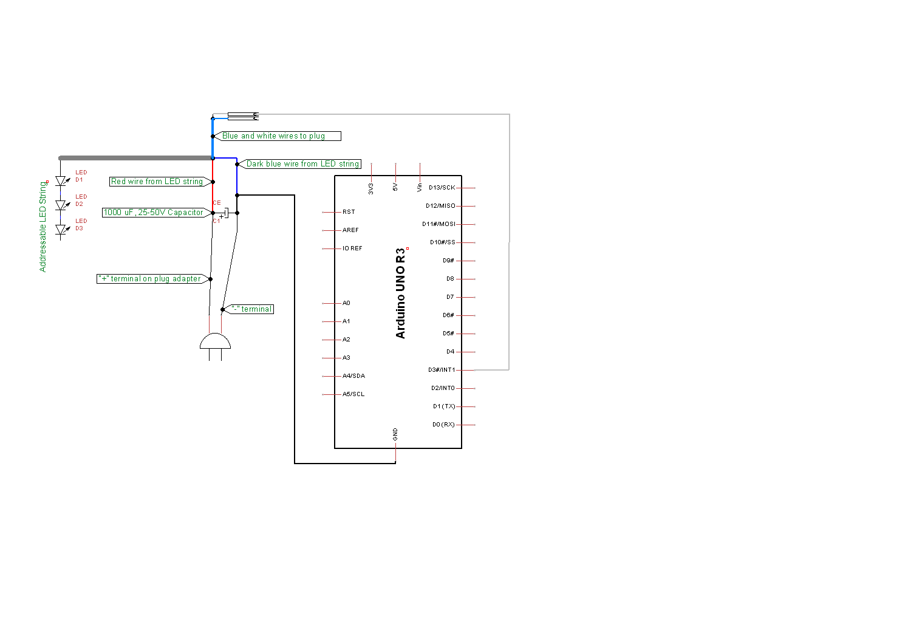

# Getting Started with FastLED, Arduino, and addressable LEDs
###### TITLE: FastLED demo
###### AUTHOR: Aaron Cammarata
###### EMAIL: aaron dot cammarata at gmail dot com
###### DATE: JAN 10, 2017
###### LICENSE: Free. Use it. Modify it. Enjoy it.
###### DEMO VIDEO: [YouTube](https://www.youtube.com/watch?v=y_TWD734Gig)

This is a demo for new programmers who want to get started making light animations with the FastLED library.
You'll need an Arduino, some lights, and all the associated power components and wires.
Unfortunately, given the number of different types of lights, Arduino boards, and development tools, it's
impossible for me to give instructions on setting up every possible configuration.

It's geared towards younger learners, or parent/child teams working and learning Arduino together.

